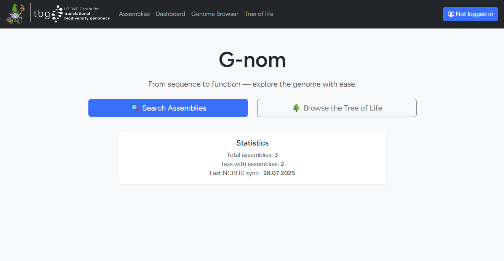

# Welcome to the G-nom docs
{ align=center }

-   :material-book:{ .lg .middle } __For users__

    ---

    Learn how to use an existing G-nom installation

    [:octicons-arrow-right-24: Getting started](./user-guide/guide.md)

-   :material-wrench:{ .lg .middle } __For sysadmins__

    ---

    Learn how to maintain and expand an existing G-nom installation

    [:octicons-arrow-right-24: Reference](./admin-guide/index.md)

-   :material-rocket:{ .lg .middle } __Installation__

    ---

    Get a new G-nom installation running in minutes using docker

    [:octicons-arrow-right-24: Installation guide](./setup.md)

-   :material-scale-balance:{ .lg .middle } __Open Source, GPL-2.0__

    ---

    G-nom is licensed under GPL-2.0 and available on [GitHub]

    [:octicons-arrow-right-24: License](https://github.com/G-nom-Project/g-nom)

--- 

G-nom open-source software developed at the Ebersberger Lab at Goethe University