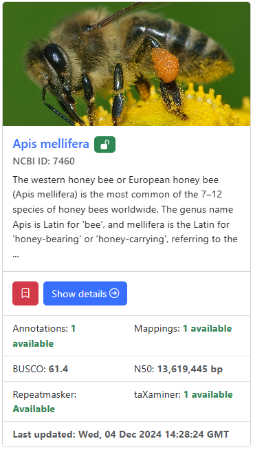

{ align=left }

The assembly card displays an image relevant to the taxon as well as a short, taxon-specific info text. The information displayed here can be edited in the [taxon editor](./taxon-editor.md). The padlock icon next to the name indicates the public acessibility of the assembly. An open lock indicates access to all user, while a closed lock indicates access limited to the currently logged in user or their team.

The corresponding assembly can be [accessed](./assembly-page.md) and bookmarked directly using the provided buttons.

Availability of certain [G-nom core analyses](../plugins.md) is indicated directly on the assembly card. The BUSCO completeness score is included directly on the assembly card, while Repeatmasker and taXaminer, alongside Annotations and Mappings, are only available as counts.

Assembly cards are used on the [user dashboard](./dashboard.md), the assembly listing and the [import dialogue](./import.md).