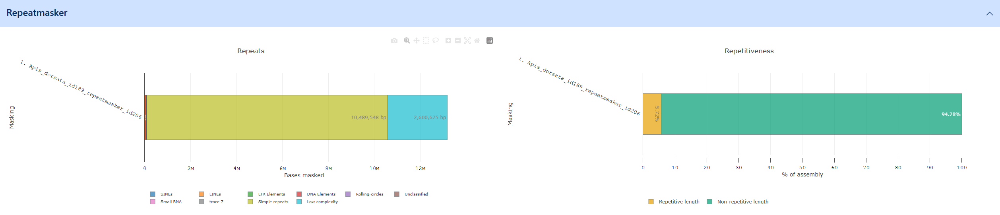

## Intro section
The first section of the assembly page is made up of a grey band detailing scientific name and the custom name of the assembly. A silouette of the species can be supplied via SVG at source e.g. from [Phylopic](https://www.phylopic.org/). The bookmark button (:material-bookmark:) is located here as well.

{ align=center }
/// caption
Overview section of the assembly page
///

The first section below the band details taxon specific information. These include an image, scientific and common names as well a short header text and longer info text. A second tab displays user-provided geodata on a world map. Image, text and geodata are customizable through the [taxon editor](./taxon-editor.md). The complete NCBI lineage is displayed in a separate field, derived from the ``taxdump`` imported into G-nom.

For users authorized to edit the assembly and/or taxa, the import dialogues (:material-wrench:) and taxon editor (:material-graph:) are accessible through blue buttons in the top bar. 

The remainder of the page is made up of four collapsible sections, which will be discussed in detail below:

1. Assembly Information
2. Annotation completeness
3. Taxonomic classification
4. Genome Browser

## Assembly Information
{ align=center }
/// caption
Breakdown of contig sizes and basic assembly metrics
///

The assembly information sections contains G-nom internal information as well common quality metrics and statistics. This includes sequence and contig size statistics as well as N50 and GC content. To assess the completeness of the assembly / related annotation, please check out the BUSCO and fCAT results in the next section.

## Annotation completeness
{ align=center }
/// caption
Example visualization of BUSCO output split across complete (single/duplicated), fragmented and missing marker genes
///

The annotation completeness section presents visualizations for BUSCO and fCAT results. The plot differentiates between Complete (Single-copy), Complete (Duplicated), fragmented and missing. Please refer to the documentation of the underlying tools ([BUSCO](https://busco.ezlab.org/busco_userguide.html#interpreting-the-results) | [fCat](https://f1000research.com/posters/11-1091)) for guidance on how to interpret the results.

## Repeatmasker
{ align=center }
///caption
Example of the Repeatmasker visualization
///
RepeatMasker genome assemblies for interspersed repeats and low complexity DNA sequences. Repeatmasker outputs a breakdown of repeats / low complexity regions as fractions of the entire genome which is available as a visualization in G-nom. Repeatmasker data for G-nom can generated automatically using the [core pipeline](../pipelines.md). The output is broken down into the following categories:

- Simple repeats: Duplications of simple sets of DNA bases (typically 1-5bp) such as A, CA, CGG etc.
- Low complexity
- SINEs: Non-functional copies of RNA genes which have been reintegrated into the genome with the assitance of a reverse transcriptase
- LINEs: Non-Retrovirus Retrotransposons
- LTR elements: Long terminal repeats
- DNA elements
- Rolling-circles
- Small RNA

## Taxonomic assignment :material-account-hard-hat-outline:
!!! warning taXaminer-dashboard

    The taXaminer-dashboard project is currently being re-structured to be published as a singular react component. This feature should be considered unstable until the migration is complete.    
    

The taxonomic assignment section includes the complete [dashboard](https://github.com/BIONF/taxaminer-dashboard) for the visualization of taXaminer results. Additionally, it integrates with you G-nom account and the genome browser.

## Genome Browser
{ align=center }
/// caption
Compact version of the genome browser with sequence and annotation data loaded
///

The genome browser section embeds a smaller version of the [JBrowse](https://jbrowse.org/jb2/) genome browser. Per default, all available tracks will be loaded. It links to selected genes in the taXaminer dashboard, allowing you to explore the genomic neighbourhood. For detailed investigation of browser tracks, consider using the [Full-screen browser](./browser.md).