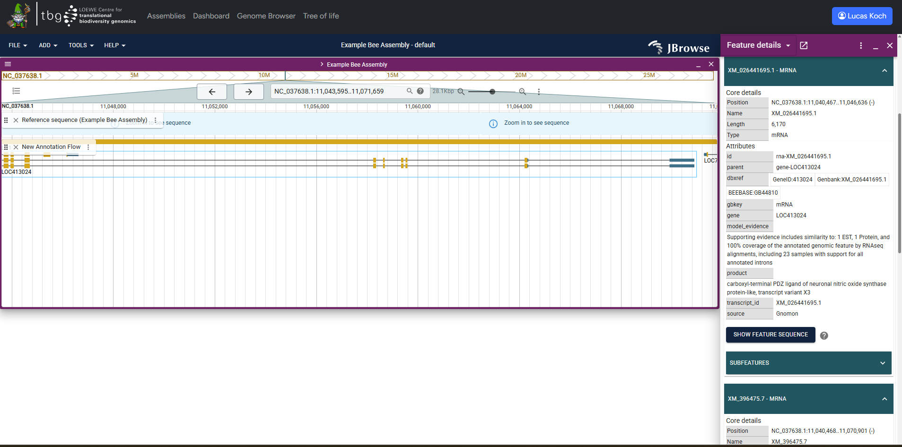

{ align=center }

G-nom integrates a fully featured genome browser powered by [JBrowse2](https://jbrowse.org/jb2/). G-nom automatically generates track configs for all genomic annotations and mappings uploaded for a given assembly. Tracks use the names provided on [import](./import.md). G-nom also generates [tabix](https://www.htslib.org/doc/tabix.html) indices automatically, enabling full-text search of annotation and mapping feature i.e. by their feature IDs.

You can find the browser under the URL `/browser` or by following the link in the navbar. Upon loading the page, you will be prompted to select one of the assemblies stored in G-nom. Once you click "Launch Browser", you will be re-directed to a page with a pre-populated JBrowse genome browser. Alternatively, the [assembly page](./assembly-page.md) provides a button in the "Genome Browser" section to jump to pre-populated JBrowse genome browser for the assembly instantly.

For further usage instruction, please refer to the [Jbrowse2 Documentation](https://jbrowse.org/jb2/docs/).

## Persistent browser sessions :material-account-hard-hat-outline:
!!! warning JBrowser Sessions

    JBrowse allows you to store and load sessions in `.json` files, requiring you to download / upload them from your device. G-nom stores these sessions server-side. Session-related options in the JBrowse dropdown menu will not affect the session stored by G-nom. 

While using the Genome Browser, G-nom will periodically store settings such as opened tracks, genomic position and track order. These settings are linked to your G-nom account and will be loaded when opening the Genome Browser, allowing you to seamlessly continue previous work across multiple devices.

A more sophisticated interface allowing you to manually manage persistent browser sessions is currently under development.

## Data access
Genome Browser tracks inherit the access policy enforced by their associated assembly. G-nom will throw a 403 Error when users try to access data they are not permitted to read.