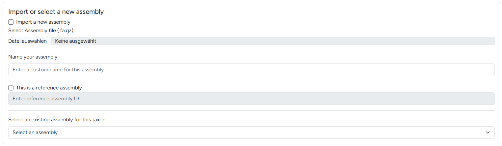
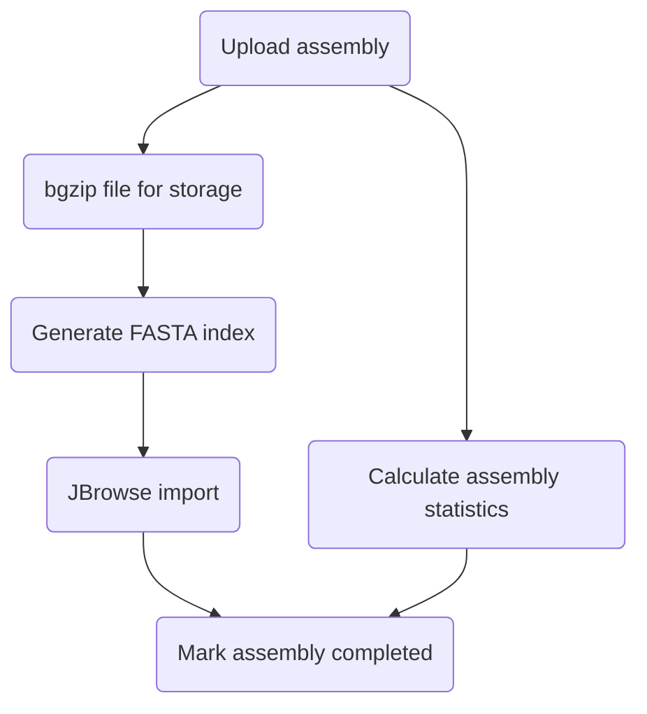
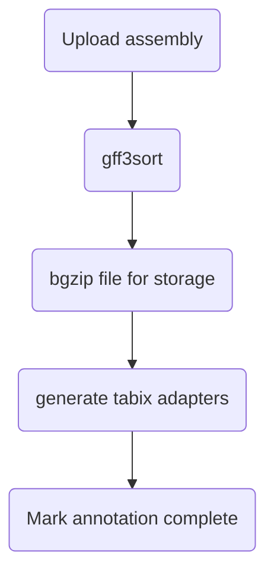
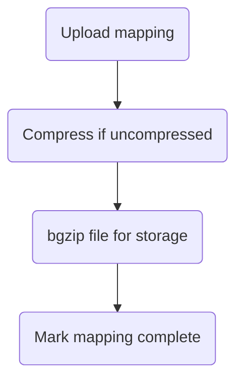

# Importing data

!!! example "Experimental interface"

    The visual interface for imports with uploads was added in the recent G-nom rework. It is functional but expected to undergo visual rennovations in the near future.

All imported data references a species NCBI ID, as outlined in the [data hierarchy](./import.md). The first step of every import is selecting the NCBI taxonomy ID in the dialogue seen below.

{ align=center }
/// caption
Taxonomy ID dialogue
///

Following the data hierarchy, your imported data is either a new assembly or references an existing assembly (e.g. mappings or annotations). The next dialogue allows you to decide between importing a new assembly or adding data for an exisiting one.

{ align=center }
/// caption
Switching between new / existing genome assembly
///

The following sections outline the import options available:

1. [Genome assemblies](#importing-assemblies)
2. [Genomic annotations](#importing-annotations)
3. [Genomic mappings](#importing-mappings)
4. [BUSCO analyses](#importing-busco-analyses)

## Importing Assemblies

!!! info Taxon Editor

    :material-account-hard-hat-outline: Future version of G-nom will automatically allow you to automatically import reference assemblies from IDs. You can track progress [here](https://github.com/G-nom-Project/g-nom/issues/7).

1. Specify the NCBI taxonomy ID of the species corresponding to your assembly as outline above
2. Under *Import or select a new assembly*, tick the *Import a new assembly* tickbox
3. Enter a name for your assembly, this will later be displayed in the [assembly page header](./assembly-page.md) and on the [assembly card](./assembly-card.md)
4. If your assembly is a reference assembly sourced from a database like NCBI or GENCODE, specify the stable ID of the assembly in the reference assembly ID field
5. At the bottom of the page click the start import button

## Importing Annotations

1. Specify the NCBI taxonomy ID of the species corresponding to your annotation
2. Select a pre-existing assembly
3. Under *Import Analyses* > *Annotation*, select a GFF file to upload and specify a custom name for the annotation. This name will be used as track label in the [genome browser](./browser.md).

## Importing Mappings
!!! warning

    :material-account-hard-hat-outline: Mapping to larger genome can lead to large mapping files exceeding 20GB. Depending on your webserver configuration, you may encounter problems uploading. In this case, dispatch the import job manually in the server filesystem.

1. Specify the NCBI taxonomy ID of the species corresponding to your mapping
2. Select a pre-existing assembly
3. Under *Import Analyses* > *Mapping*, select a SAM or BAM file to upload and specify a custom name for the mapping. This name will be used as track label in the [genome browser](./browser.md).

## Importing BUSCO analyses
!!! info

    The BUSCO analysis can be generated automatically using the G-nom [core pipeline](../pipelines.md).

1. Specify the NCBI taxonomy ID of the species corresponding to your mapping
2. Select a pre-existing assembly
3. In your BUSCO output locate the file matching `short_summary.specific.<lineage_dataset>.<output_folder>.json`
4. Under *Import Analyses* > *BUSCO*, select the aforementioned file and specify a custom name for the analysis.

## :material-dev-to: Importing fCAT analyses
*Currently under development.*
## :material-dev-to: Importing Repeatmasker analyses
*Currently under development.*
## :material-dev-to: Importing taXaminer analyses
*Currently under development.*
