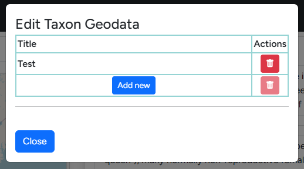

# Taxon Editor
The taxon editor allows you to add additional information to annotate your taxa. This includes info texts, images, minimalist icons and arbitrary GeoJSON data (e.g. occurrence maps).

{ align=center }
The default editor interface mimics the first section of the [assembly page](./assembly-page.md). 

## Changing the taxon image
{ align=right width="400"}
Clicking the "Edit Taxon Image" Button open the dialogue seen on the right. Here you can upload a new taxon image and provide the copyright information which will be display below the image on corresponding [assembly pages](./assembly-page.md).

Below you will find the section to upload a taxon icon. A taxon icon is a small SVG-file which is displayed next to the species name on the assembly page. The [phylopic](https://www.phylopic.org/) website is a great starting point for finding relevant SVGs.
!!! info Taxon Editor

    :material-account-hard-hat-outline: Future version of G-nom will automatically import relevant SVGs from phylopic.

## Editing info texts

For each taxon, two info texts are available, which can be edited in the text fields on the left hand side of the editor. The first edits the **headline** text, a short text which will be displayed on [assembly cards](./assembly-card.md). The second edits the longer info text displayed on assembly pages.

## Editing Geodata
!!! warning Taxon Editor

    G-nom itself does not validate GeoJSON strings. It's recommended to check your data using website like [geojson.io](https://geojson.io/) prior to importing it.

{ align=right width="400"}
The Geodata editor is available in a tab next to the taxon image along side a worldmap previewing currently available data. G-nom supports arbitrary geodata in the GeoJSON format, including single-location "pins" as well as polygon surfaces.

---

{ align=right width="400"}
All geodata object imported are required to have a title for easier identification. This title is displayed in the overview table upon click in the world map.

---

{ align=right width="400"}
The following fields are available when adding new geodata:

- **Name:** This is the aforementioned title which will be displayed when users click on the geodata object in the world map.
- **Type:** This is an optional field, designed to differentiate between different categories of metadata e.g. "occurrence". :material-account-hard-hat-outline: G-nom may enforce strict categories in the future.
- **Description:** The description is optional and will be displayed alongside the name in a pop-up bubble when users click on the geodata object.
- **Source:** Allows users to link a relevant datasource or publication.
- **Data link:** If you wish to link GeoJSON from external sources directly, it is sufficient to paste the link here. This is useful for data sources which are updated regularly, for example GBIF's species occurrence maps.
- **Raw data:** If you wish to store the geodata directly on the G-nom server itself, you can copy+paste your GeoJSON here. This option is mutually exlusive with the Data link source.